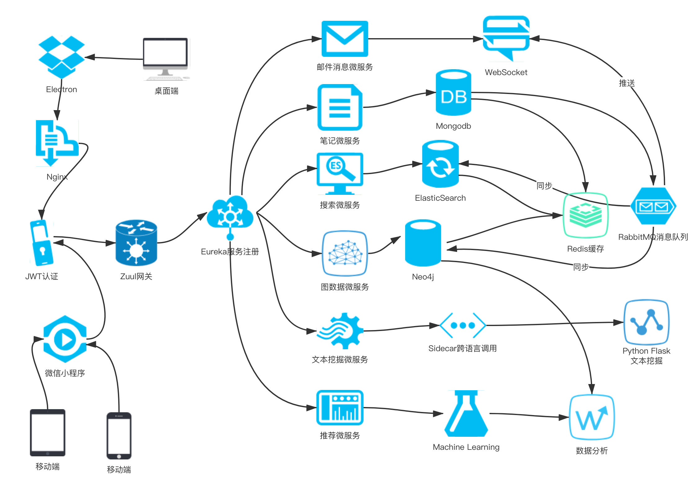

## NoteHub微服务正式版
### 架构图

### 模块说明
> common
NoteHub公共模块，定义异常、统一返回值 

> eureka-server
服务注册与发现(基本完工)

> graph-recommendation
使用图数据库实现的部分推荐功能和其他功能(基本完工)

> note-core 
NoteHub核心功能(未开发)

> python-flask
基于python提供文本关键字挖掘和摘要提取(基本完工)

> sidecar
提供跨语言调用的支持(开发中)

> utils
工具类

其他诸如网关、邮件服务、机器学习推荐算法正在酝酿中

