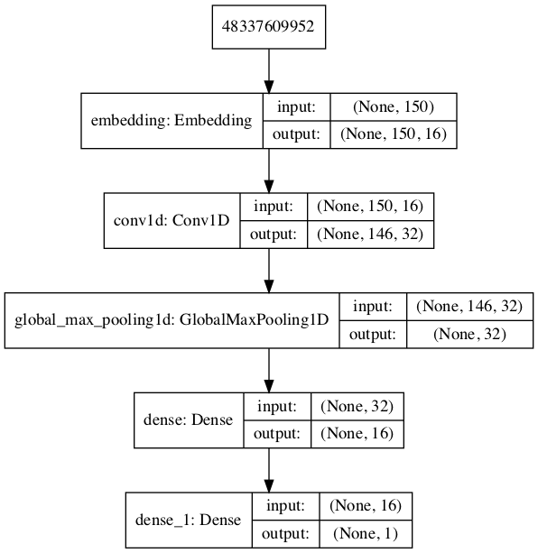

# extract part

## 配置

当前为5000端口.

## 方法

+ 当前方法较少，主要作为处理传入文本使用。

+ health检测`GET: /health`, 建议检测周期30s左右

+ analyze分析为`POST: /analyze`, 使用post方法，body内文本字段为`note`

## 简要说明

+ 除去层级数据，其他均为string，且用`,`隔开（因为标题等自身会有空格）。

+ 除去标题的任何部位出现`#`均不会计入。

+ 支持任意标题嵌入方式，乱写亦可。

+ 代码块中文字均不计入。

+ 提取关键字数组越界时直接返回tag。

> 以上均在测试文本中得以体现

## 示例

+ 正常情况下返回（参考`test.txt`）

```
{
    "code": 0,
    "data": {
        "keywords": "序列,链表,位置,sum,标号,maxsum,summaxsum,得到,数据结构,顺序,小子,实现,思路,处理,陈越,一个,数组,在线,le,ri",
        "level_titles": {
            "children": [
                {
                    "children": [
                        {
                            "children": [],
                            "level": 4,
                            "value": "luanlai"
                        },
                        {
                            "children": [
                                {
                                    "children": [],
                                    "level": 4,
                                    "value": "Max Subsequence Sum"
                                },
                                {
                                    "children": [],
                                    "level": 4,
                                    "value": "线性表的顺序存储实现"
                                }
                            ],
                            "level": 2,
                            "value": "1001 A+B Format"
                        },
                        {
                            "children": [],
                            "level": 2,
                            "value": "1002 A+B for Polynomials"
                        },
                        {
                            "children": [
                                {
                                    "children": [
                                        {
                                            "children": [],
                                            "level": 5,
                                            "value": "多的一个"
                                        }
                                    ],
                                    "level": 4,
                                    "value": "堆栈（Stack）"
                                }
                            ],
                            "level": 2,
                            "value": "1007 Maximum Subsequence Sum"
                        }
                    ],
                    "level": 1,
                    "value": "PAT刷题记录"
                }
            ],
            "level": 0,
            "value": ""
        },
        "summary": "学完链表之后顺势就可以做这个陈越姥姥出的题不过简单点的话不用实现链表类创建一个结构体就行这个题的条件给的贼合理输入是按照指数的大小从大到小输入的用链表做起来思路格外清楚而且的次数限制和的项数限制下采用链表很节约空间坑在于输出的格式系数一定要保留一位小数并且不等于零除此之外真的没有其他问题了附上C浮点数输出格式的限制方法备忘",
        "tags": "",
        "titles": "PAT刷题记录,luanlai,1001 A+B Format,Max Subsequence Sum,线性表的顺序存储实现,1002 A+B for Polynomials,1007 Maximum Subsequence Sum,堆栈（Stack）,多的一个"
    },
    "msg": "success"
}
```

+ 当内容不存在或者被鉴别不合格时（比如”# 皇家赌场“）

```
{
    "code": -1,
    "msg": "内容不存在或违规！"
}
```

## 其他

+ summary只提取了得分最高的一句话，更建议用户自己看见我们给的summary后自己可以改填。

+ 当前垃圾文本识别acc 95+。
    结构图：

    
